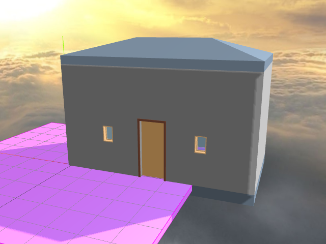

[View Revit JSON 4 Files R2]( ./view-json-revit-r1.html )
===

Many thanks to Jeremy and Matt for these models converted from Revit to Three.js JSON 4.

Stay up to date on progress at Jeremy's web site:  
[The Building Coder]( http://thebuildingcoder.typepad.com/ ) 

[read me]( #../../readme.md# )

[[O]]( #../../../../RvtVa3c/models/little_house.rvt.js#py=-10#ry=3#sx=0.01#sy=0.01#sz=0.01#displayMenuLeft )
[Little House]( #../../../../RvtVa3c/models/little_house.rvt.js#py=-10#ry=3#sx=0.01#sy=0.01#sz=0.01#add=true#displayMenuLeft )

[[O]]( #dispatch.js#../../../../RvtVa3c/models/Project1.rvt.js#px=-50#py=-10#ry=-1.5#sx=0.01#sy=0.01#sz=0.01displayMenuLeft )
[Project 1]( #dispatch.js#../../../../RvtVa3c/models/Project1.rvt.js#px=-50#py=-10#ry=-1.5#sx=0.01#sy=0.01#sz=0.01#add=true#displayMenuLeft )

[[O]]( #dispatch.js#../../../RvtVa3c/models/Project2.rvt.js#px=120#py=-10#pz=120#ry=1.6#sx=0.01#sy=0.01#sz=0.01#displayMenuLeft )
[Project 2]( #dispatch.js#../../../RvtVa3c/models/Project2.rvt.js#px=120#py=-10#pz=120#ry=1.6#sx=0.01#sy=0.01#sz=0.01#add=true#displayMenuLeft )

[[O]]( #dispatch.js#../../../RvtVa3c/models/Wall.rvt.js#px=20#py=-10#sx=0.01#sy=0.01#sz=0.01#displayMenuLeft )
[Wall]( #dispatch.js#../../../RvtVa3c/models/Wall.rvt.js#px=20#py=-10#sx=0.01#sy=0.01#sz=0.01#add=true#displayMenuLeft )

[[O]]( #dispatch.js#../../../RvtVa3c/models/Wall_2015.rvt.js#px=50#py=-10#pz=30#ry=0.1#sx=0.01#sy=0.01#sz=0.01#displayMenuLeft )
[Wall 2015]( #dispatch.js#../../../RvtVa3c/models/Wall_2015.rvt.js#px=50#py=-10#pz=30#ry=0.1#sx=0.01#sy=0.01#sz=0.01#add=true#displayMenuLeft )

[[O]]( #dispatch.js#../../../RvtVa3c/models/Wall_brick.rvt.js#px=50#py=-10#pz=50#ry=-0.03#sx=0.01#sy=0.01#sz=0.01#displayMenuLeft )
[Wall brick]( #dispatch.js#../../../RvtVa3c/models/Wall_brick.rvt.js#px=50#py=-10#pz=50#ry=-0.03#sx=0.01#sy=0.01#sz=0.01#add=true#displayMenuLeft )

[[O]]( #dispatch.js#../../../RvtVa3c/models/WallWindow.rvt.js#px=50#py=-10#pz=80#ry=0.08#sx=0.01#sy=0.01#sz=0.01#displayMenuLeft )
[Wall Window]( #dispatch.js#../../../RvtVa3c/models/WallWindow.rvt.js#px=50#py=-10#pz=80#ry=0.08#sx=0.01#sy=0.01#sz=0.01#add=true#displayMenuLeft )

[[O]]( #dispatch.js#../../../RvtVa3c/models/rac_basic_sample_project_scene.rvt.js#sx=0.01#sy=0.01#sz=0.01#noGround#noGrid#displayMenuLeft ) 
[RAC Basic Sample Project Site]( #dispatch.js#../../../RvtVa3c/models/rac_basic_sample_project_scene.rvt.js#sx=0.01#sy=0.01#sz=0.01#add=true#noGround#displayMenuLeft  ) - Takes a while to load but worth the wait!

[Load a fresh model space with skybox?]( #dispatch.js#../templates/template-skybox.html )

